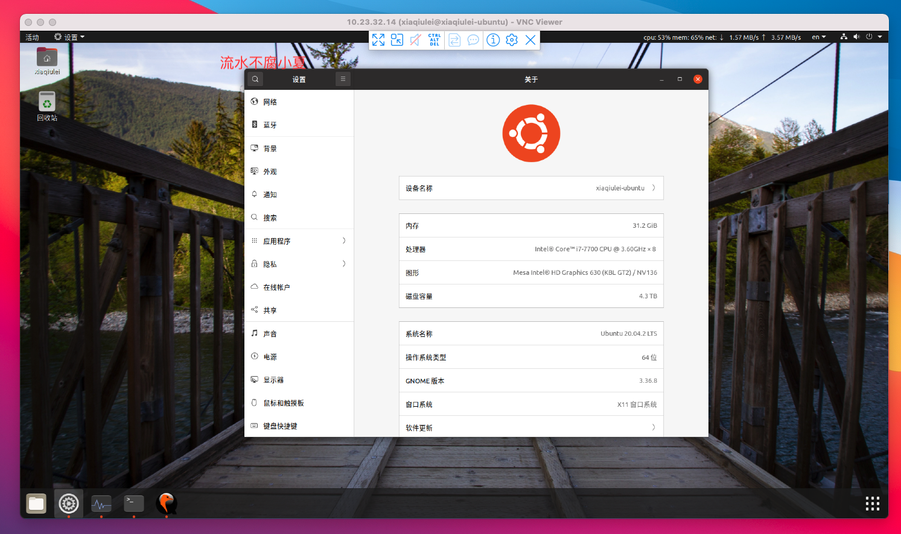
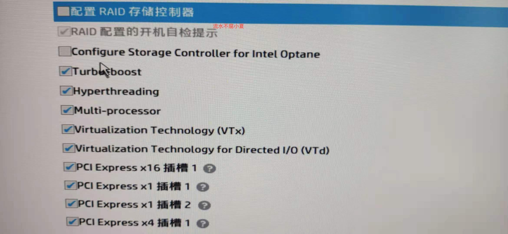

# 使用Docker安装OSX

---

因为工作关系，需要使用一些MACOS系统的电脑用作服务器，所以尝试下在ubuntu环境下使用docker安装macox。中间经历坑无数，特记录一下。

官方资料有介绍怎么安装，英语较好的同学可以直接查看官方文档。

[https://hub.docker.com/r/sickcodes/docker-osx](https://hub.docker.com/r/sickcodes/docker-osx)

[https://github.com/sickcodes/Docker-OSX](https://github.com/sickcodes/Docker-OSX)

## 准备工作

准备以下工具或环境。

* 一个工作电脑，可以用来上网查资料，最好同时具备科学上网能力，我使用的是MacBook Pro。
* 一个安装好ubuntu系统的电脑，安装必要的工具，同时修改相应的APT源。建议配置较好，至少8G内存，200G。我的是Intel Core i7、内存32G、磁盘4T。


安装好Ubuntu系统后，工作电脑可以使用ssh远程登录到ubuntu。

如果有多个显示器、键盘鼠标，当然最好，可以很容操作2台电脑。如果没有这个条件，需要在Ubuntu上开启vnc功能，工作电脑可以需要远程桌面到Ubuntu。因为我用的是Ubuntu 20.04，可以很容易的开启，其他版本可以网络查询相关资料。




Ubuntu电脑需要CPU支持虚拟化，否则无法使用。重启电脑，进入bios设置，以下为我这边的，不同电脑可能会不一样。



## 安装Docker

Ubuntu 安装docker还是比较简单，可以网上找资料，安装命令如下：

```
curl -fsSL https://get.docker.com | bash -s docker --mirror Aliyun
```

同时修改Docker源，添加`/etc/docker/daemon.json`文件。

```
{
  "registry-mirrors": [
    "https://ujkcpy2m.mirror.aliyuncs.com"
  ]
}
```

重新加载并刷新

```
sudo systemctl daemon-reload
sudo systemctl restart docker
```

首先拉取Docker镜像，先拉取后面安装会快些，镜像比较大，如果发现网络不好，建议开梯子。

官方提供2个版本，一个是`latest`，对应的是`Catalina`，另一个是`big-sur`，我这边使用的就是`big-sur`。

```
sudo docker pull sickcodes/docker-osx:big-sur
sudo docker pull sickcodes/docker-osx:naked
```

## 安装OSX

 安装必要软件，这里官网都有介绍，直接复制即可。

> Before you do anything else, you will need to turn on hardware virtualization in your BIOS. Precisely how will depend on your particular machine (and BIOS), but it should be straightforward.
>
> Then, you'll need QEMU and some other dependencies on your host:

```
# ARCH
sudo pacman -S qemu libvirt dnsmasq virt-manager bridge-utils flex bison iptables-nft edk2-ovmf

# UBUNTU DEBIAN
sudo apt install qemu qemu-kvm libvirt-clients libvirt-daemon-system bridge-utils virt-manager libguestfs-tools

# CENTOS RHEL FEDORA
sudo yum install libvirt qemu-kvm
```

> Then, enable libvirt and load the KVM kernel module:

```
sudo systemctl enable --now libvirtd
sudo systemctl enable --now virtlogd

echo 1 | sudo tee /sys/module/kvm/parameters/ignore_msrs

sudo modprobe kvm
```

启动Docker镜像，我这里安装的是`big-sur`。

```
sudo docker run -it \
    --device /dev/kvm \
    -p 50922:10022 \
    -v /tmp/.X11-unix:/tmp/.X11-unix \
    -e "DISPLAY=${DISPLAY:-:0.0}" \
    -e GENERATE_UNIQUE=true \
    -e MASTER_PLIST_URL=https://raw.githubusercontent.com/sickcodes/osx-serial-generator/master/config-custom.plist \
    sickcodes/docker-osx:big-sur
```

**注意:** 因为需要访问github，如果超时或者访问失败建议开启梯子试试。


选择磁盘


进入界面


选择磁盘工具进行格式化


关闭窗口选择安装选项，选择同意，然后就是漫长的等待时间。


中间会重启几次，记得每次选项原先格式化的磁盘


经过漫长的等待，终于进入到欢迎页面，选择对应的时区语言，设置自己的账号就可以进入系统了。


到此系统安装就已经成功。

## 后续

### 如何重启系统?

因为我这个是使用docker来启动的，后面如果保留并重启系统呢？

首先回到原先的启动终端，直接中断命令，系统会自动关闭。

然后查看docker的容器ID，使用如下命令，然后每次启动时候直接指定当前的容器ID即可。

```
sudo docker ps -a

# xxx 为对应的CONTAINER ID
sudo docker start -ai xxxxx
```


### 如何移植Docker镜像?

当前在本地电脑已经可以了，docker是可以移植的，那么如果在其他电脑运行？

官方有说明的，在docker目录找到对应的镜像文件，然后备份这个文件。

```
sudo find /var/lib/docker -size +10G | grep mac_hdd_ng.img
```

这个文件很大，我这边大概30G。


使用`naked`启动，同时附上备份的文件，添加参数`-e RAM=20`，这个表示虚拟系统使用的内存大小，可以根据自己的硬件环境选择合适的大小。

```
sudo docker run -it \
    --device /dev/kvm \
    -p 50922:10022 \
    -v "${PWD}/mac_hdd_ng.img:/image" \
    -v /tmp/.X11-unix:/tmp/.X11-unix \
    -e "DISPLAY=${DISPLAY:-:0.0}" \
    -e "NOPICKER=false" \
    -e RAM=20 \
    sickcodes/docker-osx:naked
```


启动后，系统显示内存大约为20G。


## 相关资料

[DOCKER OSX](https://hub.docker.com/r/sickcodes/docker-osx)

[DOCKER OSX Github](https://github.com/sickcodes/Docker-OSX)
